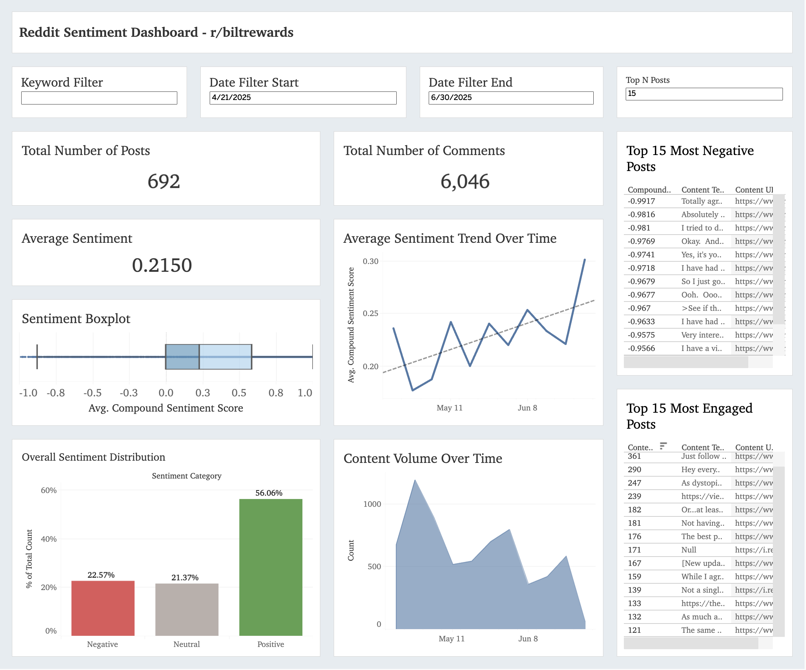

# Reddit Sentiment Analysis Dashboard

This project performs sentiment analysis on Reddit posts and comments using Python and the VADER sentiment analysis tool. The output is then visualized through an interactive Tableau dashboard. The goal is to provide an intuitive way to explore public sentiment and engagement around any subreddit over a custom time period.

## Table of Contents

- [Project Overview](#project-overview)
- [Tech Stack](#tech-stack)
- [Features](#features)
- [Running the Colab Notebook](#running-the-colab-notebook)
- [Limitations](#limitations)
- [Future Improvements](#future-improvements)

## Project Overview

With this tool, you can:

- Scrape all **posts** and **comments** from a specified subreddit within a user-defined date range.
- Perform sentiment analysis using the **VADER lexicon**.  
- Classify each piece of content as **Positive**, **Neutral**, or **Negative**.  
- Export results to a clean **CSV file**.  
- Explore key sentiment and engagement trends in a **BI tool of your choosing** (I used Tableau).  

## Tech Stack

- Python (data scraping, cleaning, and sentiment analysis).  
- `asyncpraw` (asynchronous Reddit API access).  
- `VADER` via NLTK (for sentiment scoring).  
- `pandas` (data manipulation).  
- Google Colab (notebook environment).  
- Tableau (data visualization).  

## Features

### Custom Subreddit & Date Range Input

Users are prompted to input:
- A subreddit name (e.g., `biltrewards`)
- A start and end date (e.g., `07-01-2025` to `07-31-2025`)

### Data Collected

For each post and comment, the following fields are collected:

- Title and body text  
- Score (upvotes/downvotes)  
- Number of comments  
- Created timestamp  
- Author  
- Parent ID  
- URL  

### Sentiment Analysis

Sentiment is calculated using NLTK’s VADER `SentimentIntensityAnalyzer`, which outputs:

- `neg`: Negative score  
- `neu`: Neutral score  
- `pos`: Positive score  
- `compound`: Aggregated sentiment score  

Based on the compound score:

- `Positive` (>= 0.05)  
- `Neutral` (between -0.05 and 0.05)  
- `Negative` (<= -0.05)  

### CSV Export

The processed data is exported to a `.csv` file containing all metadata and sentiment columns. This file can be used for further analysis or dashboarding.

### Tableau Dashboard

I used the exported CSV to power a [Tableau dashboard](https://public.tableau.com/app/profile/nikolai.miranda/viz/reddit-sentiment-analysis/Dashboard1) featuring:

- Keyword and date range filtering.
- Overall sentiment distribution.
- Time series views of engagement and sentiment trends.  
- Drill-downs into individual posts and comments.

Note: When importing the CSV into Tableau, ensure the text qualifier is set to quotation marks (") in the data source connection settings to properly handle fields containing commas or special characters.

## Running the Colab Notebook

To run the project in Google Colab:

1. Open the reddit_sentiment_analysis.ipynb notebook in Google Colab.
2. Install required dependencies.
3. Set up Reddit API credentials:
   - Create a Reddit app at https://www.reddit.com/prefs/apps.
   - Add your client_id, client_secret, and user_agent to the notebook.
4. Run all cells sequentially.
5. When prompted, enter:
   - Subreddit name (e.g., biltrewards)
   - Start date (e.g., 07-01-2025)
   - End date (e.g., 07-31-2025)
6. The notebook will scrape data, perform sentiment analysis, and export a CSV which you can find in the files tab of the notebook in Google Colab.

## Limitations

- Limited to public subreddits accessible via the Reddit API.
- VADER may misinterpret sarcasm, slang, or context-specific sentiment.
- Reddit API rate limits may slow down scraping for large subreddits or extended time periods. The rate limits may also cut you off before you scrape the entire collection of posts in your designated date range.
- The tool processes only text-based content, ignoring images or videos.

## Future Improvements

- Automated Live Data Ingestion: Implement scheduled scraping to continuously pull new Reddit data and directly load it into a relational database (e.g., PostgreSQL or MySQL) instead of static CSVs.
- Real-time Tableau Connection: Configure the Tableau dashboard to connect directly to the database via a live connection, ensuring the dashboard updates automatically with the latest sentiment data.
- Explore integrating more sophisticated NLP models to enhance sentiment analysis accuracy.
